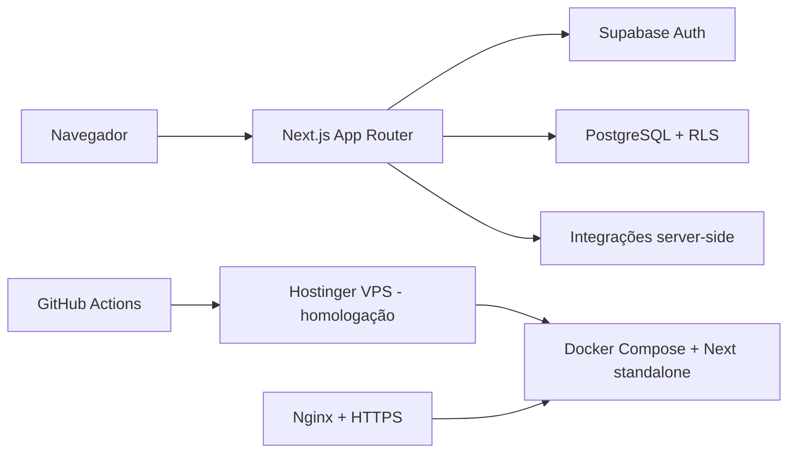

# Arquitetura

## Decisão

O sistema de login é a fundação da aplicação final. Ele já contém autenticação SSR, autorização, migrations, RLS e auditoria. O CRM original será tratado como fonte de páginas, componentes e regras de negócio, não como fundação de runtime.

## Componentes alvo

## Decisões registradas

1. **Next.js nativo.** Vinext/Vite eram uma camada específica da geração Cloudflare e produziam incompatibilidades com módulos `cloudflare:` e a data de compatibilidade. Foram excluídos da arquitetura alvo.
2. **Supabase em vez de D1.** O banco final é PostgreSQL, com migrations SQL, grants e RLS. Drizzle/D1 não será copiado automaticamente; cada modelo do CRM terá migration revisada.
3. **Autenticação única.** O fluxo Supabase SSR da base substitui cookies e rotas de autenticação manuais do CRM.
4. **Autorização em profundidade.** Menus e páginas respeitam permissões, mas APIs, Server Actions e RLS também as impõem.
5. **Deploy `standalone` em VPS.** Docker Compose empacota o runtime de forma reproduzível, publica o Next.js apenas em loopback e deixa o Nginx como única entrada pública. O Supabase local usa um stack separado e nunca é parte do Compose de produção.
6. **Versões exatas.** `package.json` e lockfile fixam a base homologada; atualizações futuras serão seletivas e testadas.
7. **Catálogo autorizado.** `app_pages` é a fonte da navegação. RLS filtra páginas pela permissão efetiva; guardas de rota e RPCs continuam sendo as fronteiras de segurança.
8. **Provisionamento mínimo.** Novas contas Auth recebem perfil ativo e papel `user`. O painel só modifica alvos abaixo do nível do ator e toda mutação é auditada.
9. **Dashboard normalizado.** O read model separa snapshot, visão, métricas e ranking de empreendimentos. A UI lê com a sessão SSR e nunca usa fallback demonstrativo.
10. **Metas mensais auditadas.** Os funis DV e parcerias compartilham uma tabela tipada por perfil/mês. A escrita ocorre por Server Action e RPC, que recalcula as etapas e audita atomicamente.
11. **Pontos normalizados.** Pesos e objetivos do ranking são linhas tipadas, legíveis por `crm.ranking.view`; a substituição integral exige `crm.settings.manage` e gera auditoria.
12. **Ranking recalculável.** O read model guarda atividades por corretor/período, não pontuações finais. Corretores e gerentes são classificados com os pesos atuais, sem regravar o snapshot.
13. **Etapas sem duplicação.** As cinco análises detalhadas leem as mesmas métricas autorizadas do dashboard; não existe uma segunda fonte ou tabela derivada para a mesma informação.
14. **Ingestão transacional.** O produtor Salesforce envia um contrato versionado a um Route Handler M2M limitado. Uma RPC exclusiva do papel de serviço substitui dashboard e ranking atomicamente, impede replay/snapshot antigo e registra execução sanitizada. A capacidade possui flag server-side própria e desativada por padrão.
15. **Refresh sob demanda.** O navegador nunca acessa credenciais Salesforce. Sessão, permissão, origem, lock e cooldown são verificados antes de um webhook HTTPS configurado por ambiente. Uma flag independente permite manter o refresh desativado sem URL ou Bearer.
16. **Preferência visual local.** Tema é estado de apresentação não sensível em `localStorage`; autorização e catálogo continuam resolvidos no servidor. O shell aplica somente três valores conhecidos e falha para claro.
17. **Identidade externa governada.** IDs Salesforce/Qlik/n8n são resolvidos por fonte, tipo, versão temporal, owner e evidência. Nomes são apenas rótulos; mappings ausentes rejeitam a publicação e entram em reconciliação.
18. **Read model v3 escopado.** Runs, fatos e manifestos de cobertura por escopo são imutáveis e publicados por RPC transacional exclusiva de máquina, depois de validar a autoridade privada da tupla dataset/fonte/workflow/produtor. O navegador usa somente RPC autenticada com permissão do dataset, scope explícito, lineage efetivo e filtros canônicos validados no banco. Zero real exige período integralmente certificado e o escopo exato no manifesto.
19. **Rollout shadow deny-by-default.** As rotas e o catálogo de produção permanecem v2. O v3 fica fora da navegação, retorna 404 salvo flag server-side explícita e suas permissões são catalogadas sem herança automática para papel algum. Qualquer grant real exige migration posterior, depois de IDs, owners, produtores e políticas serem reconciliados. Fonte indisponível, fórmula não aprovada e zero real permanecem estados distintos.

## Fronteiras de segredo

Chaves públicas do Supabase podem chegar ao navegador e permanecem limitadas por grants/RLS. Secret key, service role, credenciais PostgreSQL, Salesforce refresh token e `INGEST_SECRET` existem somente em ambiente server-side/gerenciador de segredos. Nenhuma integração pode registrar token em log.

## Próximas decisões da migração

- Estratégia de dados seed/demonstração separada dos dados reais.
- Observabilidade e alertas da ingestão em homologação.
- Contrato operacional definitivo com o produtor Salesforce/n8n real.
- Identificação nominal e relay M2M do caller Qlik antes do hardening remoto.
- Rollout por papel do read model v3 após reconciliação dos scopes oficiais.
- Contratos oficiais de metas, planejamento, estoque, ranking e parcerias.

Essas decisões serão implementadas incrementalmente nas próximas branches.
